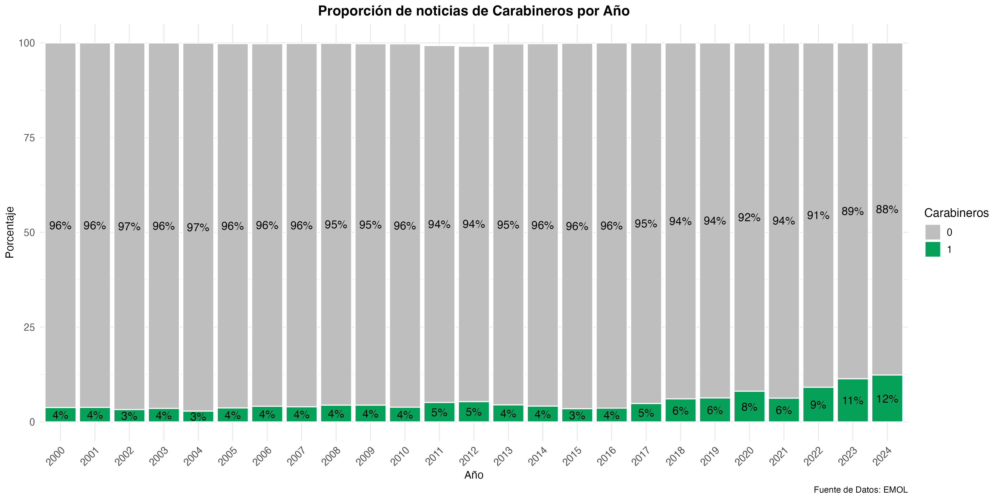
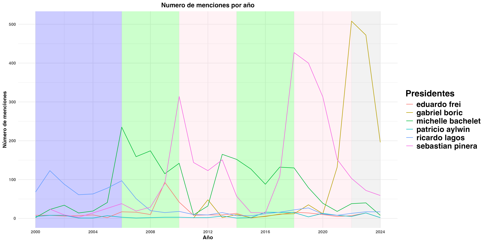
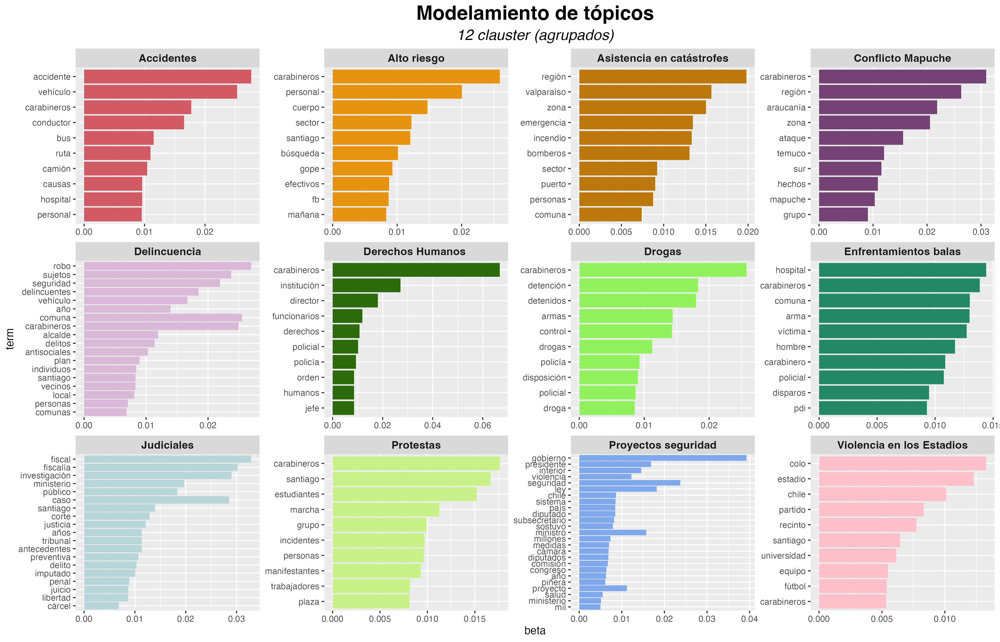
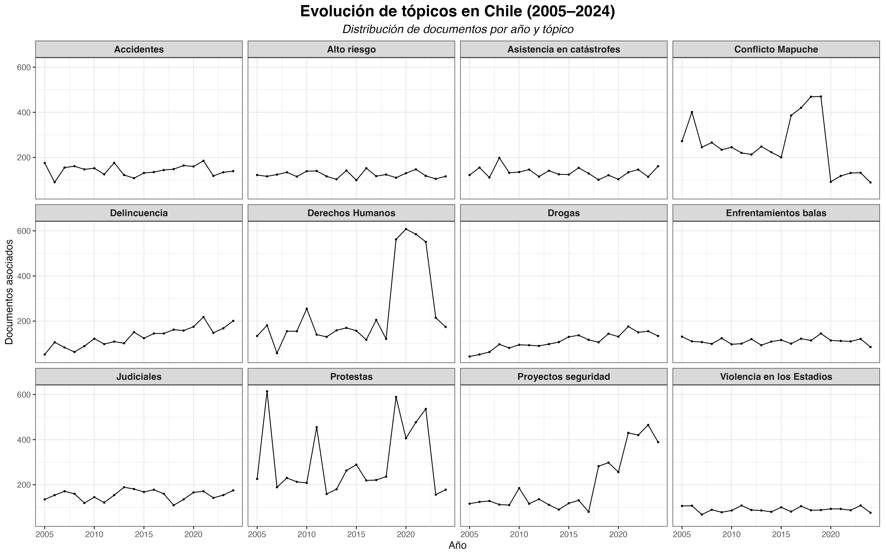
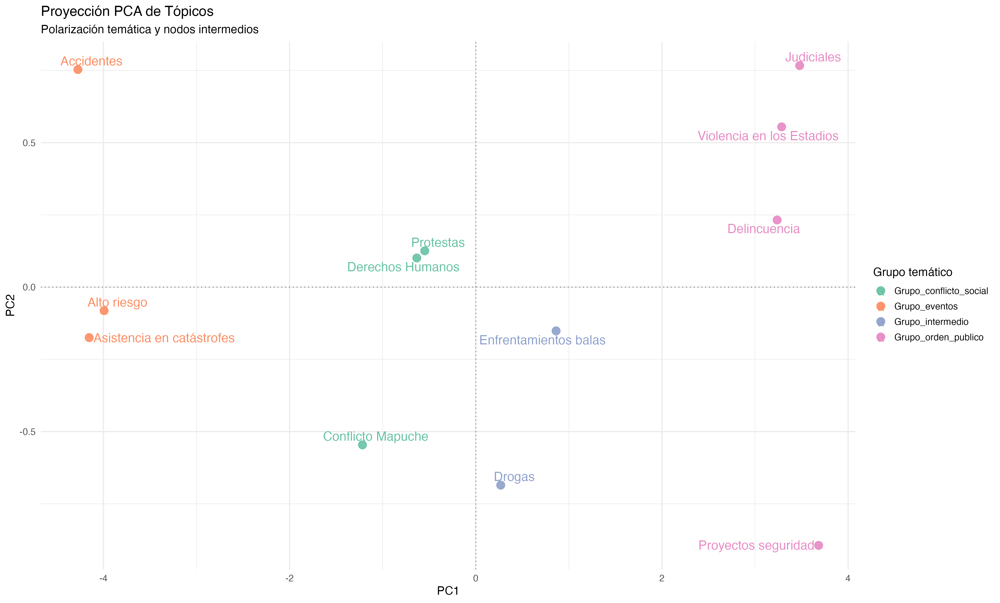

```{r Setup}
#| include: false
# Add default ggplot theme. This can be overridden by your own theme at
# the end of the ggplot graph.

# DIME:
source("_extensions/dime/setup_dime_palettes.R")
source("_extensions/dime/setup_ggplot2_dime.R")
# Worldbank:
# source("_extensions/dime/setup_dime_palettes.R")
# source("_extensions/dime/setup_ggplot2_dime.R")

# Install R libraries
if (!require("pacman")) install.packages("pacman")
pacman::p_load(
  dplyr, DT, ggplot2, ggpubr, ggrepel, ggtext, gt, here, huxtable, 
  knitr, leaflet, osmdata, pacman, pagedown, palmerpenguins,
  reactable, sf, tidyr, tidyverse
)
```

## Autores

::: {.columns .vh-center-container}
::: {.column width="33%"}


**Matías Deneken**

OLES & Pontificia Universidad Católica de Chile
:::

::: {.column width="33%"}


**Matías Gomez**

OLES, Pontificia Universidad Católica de Chile y Universidad Central de Chile
:::

::: {.column width="34%"}


**Ismael Puga**

OLES y Universidad Central de Chile
:::
:::

## Introducción

Los **medios de comunicación** desempeñan un papel crucial en la **construcción de la legitimidad y la percepción pública** sobre las acciones de las policías. Diversas investigaciones han evidenciado cómo la cobertura mediática influye en los niveles de confianza y las actitudes ciudadanas hacia las instituciones policiales [(Jonathan-Zamir et al., 2016; Chermak, 1995)]{style="color:blue"}.

Para Chile los estudo se han centrado en:

-   Cómo los medios encuadran hechos en qué los carabineros están involucrados (Ej: [Anais & Vergara, 2016; Chacón & Rivera, 2020)]{style="color:blue"}.
-   Estudio del rol de los medios en la transmisión del miedo y la inseguridad, con las policías como actores centrales (Ej: [Espinoza-Bianchini, 2023)]{style="color:blue"}.
-   Construcción de legitimidad de carabineros durante protestas (Ej: [Bonner & Dammer, 2022)]{style="color:blue"}.

## Sobre este estudio

Los estudios sobre medios de prensa y carabineros comparten una característica común: Son cualitativos y su recolección de datos es manual.

El uso de técnicas cuantitativas (y computacionales) para el estudio de las policías en el mundo han evidenciado vaivenes según la brutalidad en que los hechos se informan y cómo ello afectan los sentimientos hacia esta institución ([Succar et al., 2024]{style="color:blue"}).

Considerando el creciente interés en la adquisición de las técnicas computacionales en las Ciencias Sociales (*→ Ciencias Sociales Computacionales)* se busca analizar la evolución de la cobertura mediática sobre Carabineros de Chile durante las últimas dos décadas.

Se utilizará la técnica de webscrapping a medios de prensa y *Natural Language Processing* (codificación automática y machine learning no supervisado) *→* aproximación novedosa y cuantitativa al estudio de la prensa en Chile.

## Marco teórico: Violencia y legitimidad (1/3)

La legitimidad policial es clave para el funcionamiento democrático, pues promueve el cumplimiento de normas cuando los ciudadanos creen que la autoridad actúa justamente ([Tyler et al., 2006a: Jackson, 2018]{style="color:blue"}).

-   La legitimidad policial depende fuertemente de la **percepción de justicia procedimental** ( [Jackson et al., 20]{style="color:blue"}12).

-   **Abusos de poder y corrupción** erosionan esa legitimidad ([Curtice, 2021, Bradford et al., 2014)]{style="color:blue"}.

-   La **efectividad percibida** también influye, pero su impacto es **condicional a que cumplan sus normas**.

-   [Sunshine & Tyler (2003)]{style="color:blue"}muestran que la **justicia procedimental** es más influyente que la efectividad en generar cooperación ciudadana.

En este contexto, los medios de comunicación adquieren un papel central. No solo informan sobre el actuar policial, sino que **configuran marcos interpretativos que moldean las percepciones ciudadanas sobre su justicia, eficacia y legitimidad**.

## Marco teórico: Cobertura & Brutalidad (2/3)

::: columns
::: {.column width="50%"}
**News Coverage**

Diversos estudios han mostrado que el encuadre (*framing*) mediático varía según el contexto: las coberturas sobre crimen tienden a ser positivas (garante del orden); en cambio, las protestas suelen ser cubiertas desde una mirada más crítica, que enfatiza el conflicto ([Succar et al., 2024]{style="color:blue"}).

Cuando los medios enfatizan fallos institucionales o uso excesivo de fuerza, el encuadre resulta en una disminución de legitimidad. Estas narrativas erosionan la confianza y pueden aumentar la percepción de arbitrariedad en el accionar ([Tyler & Huo, 2002]{style="color:blue"}).
:::

::: {.column width="50%"}
**Police Brutality**

En EE.UU., el concepto de brutalidad policial se ha usado principalmente en el contexto de violencia ejercida contra minorías raciales ([Ej: #BlackLivesMatter, Fridikin et al. 2017; Bonilla & Rosa, 2015)]{style="color:blue"}.

Sin embargo, el término se ha extendido a otros contextos donde la policía ejerce violencia excesiva como en la represión de protestas ([McLeod & Detenber, 1999; Chan, 2015)]{style="color:blue"}.

En Chile este concepto no ha sido lo suficientemente indagado, siendo útil para describir el uso desproporcionado de la fuerza por parte de Carabineros.
:::
:::

## Marco teórico:  El estudio (3/3)

A diferencia de los estudios tradicionales sobre legitimidad policial, que se basan mayoritariamente en encuestas transversales y análisis cualitativos de noticias específicas, este estudio adopta un enfoque **computacional y longitudinal** para analizar la cobertura de prensa sobre Carabineros de Chile entre 2000 y 2023.

Se asume que **la legitimidad de las policías se construye discursivamente**: los medios no solo reflejan la efectividad o justicia policial, sino que la **interpretan, amplifican o erosionan** mediante marcos narrativos y verbos de acción ([Kingshott, 2011]{style="color:blue"}).

La investigación se inscribe en el campo emergente de las **Ciencias Sociales Computacionales**, que busca aprovechar técnicas de IA y procesamiento masivo de datos para revelar patrones a gran escala ([Cioifii-Revilla, 2014; Lazer et al., 2020]{style="color:blue"}).

Este enfoque permite superar las limitaciones de la codificación manual y avanzar hacia una **medición sistemática y reproducible** de la cobertura mediática, identificando **tendencias, cambios y eventos críticos** en el tratamiento periodístico de Carabineros → Se propone una contribución metodológica que no solo explora el qué se dice de la policía, sino también **cómo se construye su legitimidad en el discurso mediático**.

## Metodología: Datos y recolección (1/3)

#### Perspectiva teórica - metodológica

Las palabras no solo informan, sino que **actúan performativamente**: encuadran, legitiman, cuestionan y movilizan emociones colectivas ([Austin, 1962]{style="color:blue"}).

#### Fuente de datos

El corpus analizado proviene del portal de noticias **El Mercurio Online (EMOL)**, abarcando el período entre junio del año 2000 y diciembre del 2023.

#### Recolección de datos

La recolección de datos se realizó mediante **técnicas de web scraping** que permiten extraer información de forma automatizada y sistemática desde sitios web. Para ello, se empleó el software **R**, lo que permitió capturar un universo total de **1.052.167 noticias**, de las cuales **51.533 (5%)** contienen al menos una mención a *Carabineros*.

## Metodología: Datos y recolección (2/3)

**Codificación automática: diccionario léxico**

En base a la información textual podemos identificar si una noticia se encuentra o no asociada un término en particular (forma deducativa de codificación) siempre y cuándo se encuentre asociada con la palabra de carabineros.

| Tema                          | Términos claves                                                                          | Sujetos asociados                                                |
|-------------------|------------------------------|-----------------------|
| Delitos y crímenes comunes    | Asalto, robo, hurto, narcotráfico, homicidio, femicidio \[...\]                          | Ladrón, delincuente, homicida, agresor \[...\]                   |
| Protestas y movilizaciones    | Disturbios, protestas, manifestaciones, estallido social, movimiento estudiantil \[...\] | Manifestantes, estudiantes, feministas, líderes sociales \[...\] |
| Asuntos étnicos-territoriales | Conflicto indígena, macrozona sur, zona roja \[...\]                                     | Mapuche, comuneros, lonko, pueblos originarios                   |

Ello nos permitirá evidenciar las tendencias de temáticas y su relación con Carabineros a lo largo del tiempo.

## Metodología: Machine Learning no Supervisado (3/3).

Procesamiento de Lenguaje Natural (NLP) no supervisado mediante la técnica de Topic Model en su versión de **Latent Dirichlet Allocation (LDA)**. LDA funciona asignando **tópicos probables a cada palabra**, basándose en dos ideas:

1.  Cada **documento** está formado por una mezcla de temas (por ejemplo: seguridad, manifestaciones, conflicto indígena).

2.  Cada **tema** está formado por un conjunto característico de palabras (por ejemplo: delincuencia, robo, ladrón para seguridad).

El algoritmo **aprende patrones de co-ocurrencia** de palabras para estimar estas combinaciones: Intentamos descubrir los temas ocultos que hay en un conjunto de texto.

Se usa una **fórmula de probabilidad**: $$
P(z = k \mid w, d) \propto \frac{n_{w|k} + \beta}{n_k + V\beta} \cdot \frac{n_{k|d} + \alpha}{n_d + K\alpha}
$$

## Resultados (1/4): Proporción tendencial

{fig-align="center" width="489"}

## Resultados (1/4): Actores

{fig-align="center"}

## Resultados (1/4): Eventos

{fig-align="center"}

## Resultados (2/4): ML - NS

| **Tópico**                | **Términos clave**                                    |
|--------------------------|----------------------------------------------|
| Accidentes                | accidente, vehículo, carabineros, conductor, bus      |
| Alto riesgo               | carabineros, personal, allanamiento, droga, sector    |
| Asistencia en catástrofes | región, valparaíso, zona, emergencia, incendio        |
| Conflicto Mapuche         | carabineros, región, araucanía, zona, ataque          |
| Delincuencia              | robo, sujetos, seguridad, delincuentes, comuna        |
| Derechos Humanos          | carabineros, institución, director, derechos, humanos |
| Drogas                    | carabineros, detención, detenidos, armas, control     |
| Enfrentamientos balas     | hospital, carabineros, arma, víctima, disparos        |
| Judiciales                | fiscal, fiscalía, investigación, ministerio, caso     |
| Protestas                 | carabineros, estudiantes, marcha, incidentes, plaza   |
| Proyectos seguridad       | gobierno, presidente, interior, seguridad, sistema    |
| Violencia en los Estadios | colo, estadio, chile, partido, universidad            |

## Resultados (2/4): ML - NS

{fig-align="center"}

## Resultados (3/4): Tópicos

{fig-align="center"}

## Resultados (4/4): PCA

{fig-align="center"}

## Conclusiones
